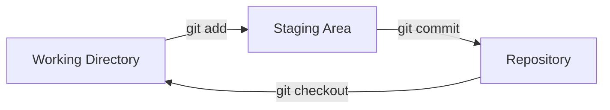

## Step 2: Creating Your First Repository

Now that we are familiar with the sample project and informed Git who we are, let's get our game into version control!

### 📖 Theory: The Git Workflow

The Git workflow involves three main areas:

- **Working Directory**: Your project files where you are making changes.
- **Staging Area (Index)**: A preparation area for grouping changes you want to save to history.
- **Repository**: The permanent records of your project's development history.



### What are the important Git commands?

Git has many operations, but the there are a few you will use the most for local projects.

- `git init` - Start a new repository to enable versioning.
- `git add` - Group related changes together in the staging area, in preparation to "commit" them to history.
- `git commit` - Save or "commit" the changes in the staging area to the project's history.
  - commit message - A short description of the changes to help keep the history organized.
- `git status` - View the current state of your working directory and staging area.
- `git checkout` - Change your working directory to a different version from the repository history.

> [!TIP]
> Concise, descriptive, and non-generic commit messages will make your project history easier to understand (and help find future bugs)!

### ⌨️ Activity 1: Initialize a repository (using the CLI)

Let's add version control to our game and commit the current version.

1. Initialize a new Git repository.

   ```bash
   git init
   ```

1. Check repository status. Notice that all files are marked as "Untracked".

   ```bash
   git status
   ```

1. Move our game to the staging area to prepare it for committing to the repository history.

   ```bash
   git add src/main.html
   git add src/main.js
   ```

1. Check repository status. Notice that our source files are now tracked.

   ```bash
   git status
   ```

1. Commit the changes to the repository history.

   ```bash
   git commit -m "Initial commit"
   ```

1. Check repository status. Notice that nothing shows since there are no changes.

   ```bash
   git status
   ```

### ⌨️ Activity 2: Start tracking a file (using VS Code)

Let's use our code editor to start the documentation for our game.

1. In the file explorer, click the **New File...** icon and enter the following filename.

   ```txt
   README.md
   ```

1. Open the file and enter the following content.

   ```md
   # Stack Overflown

   Organize the falling blocks into the current debug pattern before the stack overflows! ⏳
   ```

1. In the left navigation, select the **Source Control** tab. Notice that your `README.md` file is listed.

1. Stage the file by by hovering over file and selecting the plus sign `+` button.

1. Enter a commit message and press the **Commit** button.

   ```txt
   Start game documentation
   ```

### ⌨️ Activity 3: (Optional) Ignore files from version control

As your project grows, you will quickly realize you do not want some files tracked. You can tell Git to ignore them with the `.gitignore` file.

This can help prevent accidentally sharing sensitive information like passwords, and help keep the project organized by not saving generated content like analysis results or builds.

1. Create a `.gitignore` file.

   ```bash
   touch .gitignore
   ```

1. Add common patterns like `*.log`, `.env`, and `node_modules/`

1. Create a temporary file that matches a gitignore pattern

1. Verify that `git status` doesn't show the ignored file

1. Stage and commit the `.gitignore` file

<details>
<summary>Having trouble? 🤷</summary><br/>

- If `git status` shows unexpected files, double-check the files you have staged with `git add <file name>`
- Use `git add .` to stage all files at once (except ignored files)
- Remember to commit the `.gitignore` file itself so others can benefit from it

</details>
