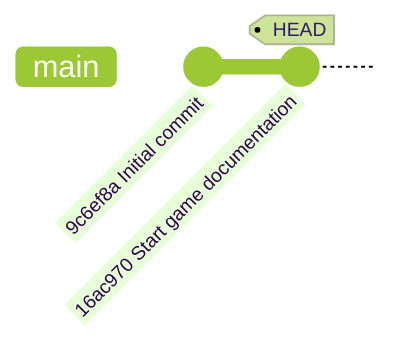

## Step 3: Exploring Git History

With our game now tracked in Git, let's learn how to explore what changes were made, when they were made, and by whom.

### 📖 Theory: Understanding Git History

Git maintains a complete history of your project through commits. Each commit contains:

- **Unique hash ID**: A unique identifier to easily it in the history.
- **Parent commit**: Reference to the previous commit, creating a chain.
- **Author information**: Who made the changes.
- **Timestamp**: When the changes were applied.
- **Commit message**: Description of the changes included in that commit.

The `HEAD` pointer in the below diagram indicates your current position in the project history.



### What are the important Git commands?

Everyone has a different preference for exploring the history.
Here are a few of common commands and options you might like.

- `git log` - Display the history of the project.
  - `git log --oneline` - Show one commit per line, but with less detail.
  - `git log --graph` - Show a visual diagram of the commits.
  - `git log --name-status` - Show the tracking status each file.
- `git checkout` - Modify tracked files to match a different point in the history.

### ⌨️ Activity 1: Explore the history (using the CLI)

1. Show the full commit history.

   ```bash
   git log --oneline
   ```

1. Show the tracking status of files.

   ```bash
   git log --oneline --name-status
   ```

1. Show a visual graph of the full commit history.

   ```bash
   git log --graph --oneline
   ```

1. Copy the **Commit ID** of the "Initial commit" entry. Use it to checkout the earlier version. Notice that the documentation file `README` has disappeared.

   ```bash
   checkout <commit id>
   ```

1. Return to the latest version.

   ```bash
   checkout HEAD
   ```

### ⌨️ Activity 2: Explore the history (using VS Code)

1. In the left navigation, open the **Source Control** tab and expand the **Graph** panel. Notice the timeline list of your recent commits.

1. Click an entry to show a list of the files modified by that commit.

1. With a commit entry expanded, double-click on a file to view the detailed file changes.

1. Open the `README.md` file and add the following content.

   ```md
   ## How to Develop

   - `main.html` - the game container for playing
   - `style.css` - the game formatting and styling
   - `main.js` - the primary game logic
   - `patterns.js` - the error patterns to match during gameplay
   ```

1. In the **Changes** panel, notice the listed file. Add it to the staging area and commit it with the below message.

   ```md
   Start developer instructions
   ```

<details>
<summary>Having trouble? 🤷</summary><br/>

- If you don't see the Graph section, you may need to install the "Git Graph" extension
- Use `git log --help` to see all available options for viewing history
- Try `git show <commit-hash>` to see details of a specific commit

</details>
