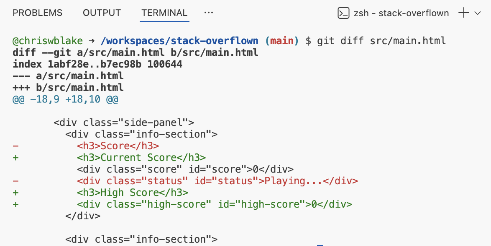
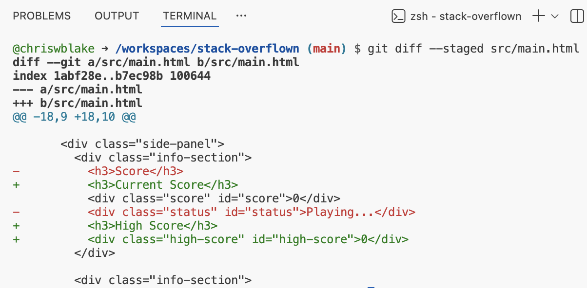
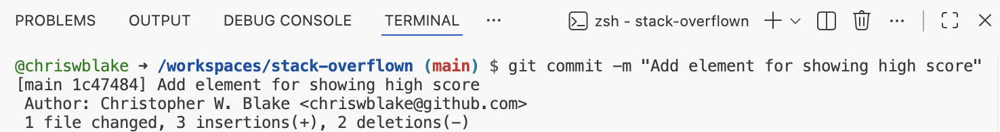

## Step 4: Comparing Changes

Now that we understand how to "undo", let's make some real game changes! And more importantly, learn how Git can show us what was changed **before** we commit it to the repository history.

Understanding file differences is crucial for reviewing your work and catching errors!

### 📖 Theory: Understanding Diffs

Git uses symbols and coloring to show file changes:

- `+` in green indicates lines that were added
- `-` in red indicates lines that were removed

> [!TIP]
> You can change Git's default comparison colors with the below commands.
>
> ```bash
> git config --global color.diff.old yellow
> git config --global color.diff.new blue
> ```

### What are the important Git commands?

The `git diff` command shows differences between development states.

- `git diff` - Differences between the working directory and the staging area.
- `git diff --staged` - Differences between staging area and previous commit.
- `git diff HEAD~1` - Differences between current commit and previous commit.

### ⌨️ Activity 1: View differences (using the CLI)

1. Open `src/main.html` and navigate to around `line 20`.

1. Replace the `info-section` area about scoring with the below example.

   ```txt
   <div class="info-section">
      <h3>Current Score</h3>
      <div class="score" id="score">0</div>
      <h3>High Score</h3>
      <div class="high-score" id="high-score">0</div>
   </div>
   ```

   This will change 3 things:

   - Modify the `Score` label to `Current Score`
   - Add the `High Score` information.
   - Remove the `status` information.

1. View the difference between your working directory and the last commit.

   ```bash
   git diff src/main.html
   ```

   

1. Promote the changes into the staging area.

   ```bash
   git add src/main.html
   ```

1. Run the same comparison again. Notice that no changes are displayed, because the working directory now matches the staging area.

   ```bash
   git diff src/main.html
   ```

1. View the differences between the staging area and the last commit.

   ```bash
   git diff --staged src/main.html
   ```

   

1. Commit the changes with the following message.

   ```md
   git commit -m "Add element for showing high score"
   ```

   

### ⌨️ Activity 2: View differences (using VS Code)

1. Open `src/patterns.html` and navigate to around `line 4`.

1. Replace the `Null Pointer` area with the below example to change the pattern.

   ```txt
   {
    name: "Null Pointer",
    pattern: [
      [0, 1, 1, 1, 0],
      [0, 1, 0, 1, 0],
      [0, 1, 1, 1, 0],
      [0, 0, 1, 0, 0],
      [0, 0, 1, 0, 0],
    ],
   }
   ```

1. In the left file explorer, notice file name changed color and now has an `M` indicating it is modified.

   

1. Open the **Source Control** tab. In the **Changes** list, double-click the `patterns.js` file to open the Diff (comparison) view.

   

   

   > 💡 **Tip**: You can modify the content in the comparison view for live feedback!

1. Promote the the file to the **staging** area. ⚠️ Don't commit yet!

   Notice the comparison view stopped showing changes since the current file matches the **Staging** area.

   

1. In the **Staged Changes** list, double-click the `patterns.js` file to open the Diff (comparison) view.

   Notice that you can't make changes now. The staging area is locked in preparation for committing.

   

   

1. Add the following commit message and press the **Commit** button.

   ```txt
   Make null pointer pattern easier to complete
   ```

<details>
<summary>Having trouble? 🤷</summary><br/>

- If the list of change is longer than one screen, you can press `q` to exit the scrolling file viewer.

</details>
