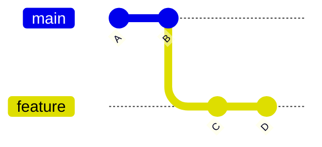
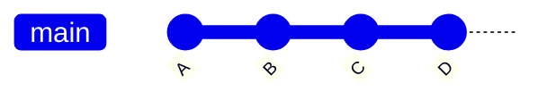
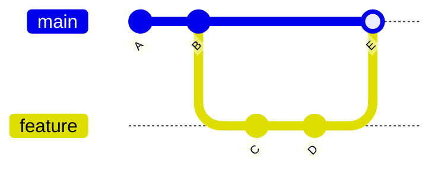
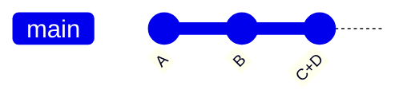

## Step 5: Working with Branches

With our game now tracked, we know it is easy to return to a working version. And since we can see the exact changes we are committing to history, we know nothing unrelated will be included.

But now, that brings up more questions! 😱

"How do I prevent a messy history?"

"How do I avoid non-working versions in the history from incomplete work?"

"What if I need to work on multiple features/fixes at the same time?"

### 📖 Theory: Understanding Branches

Branches in Git are lightweight pointers (like labels) to specific commits. This allows working on a dependent version without influencing the original, something great for parallel feature development and collaboration.

Key Concepts:

- **`main` Branch**: Usually the trusted working version, and the first branch. (historically called `master`)
- **Feature Branch**: A safe isolated space to develop without affecting the trusted version.
- **Merging**: Combining changes from different branches.

### How do you combine branches?

There are multiple strategies for organizing commits. Usually, all in the name of different styles of organization, transparency, and traceability. Let's introduce the most common.

**Fast-forward merge**: Move the new commits from the child branch onto the parent branch.

<div align="center">

**Before:** Original



**After:** Fast Forward Merge



</div>

**Merge commit**: Apply the changes as a single new commit on the parent branch. Leave the child branch in the network for traceability.

<div align="center">

**Before:** Original


**After:** Merge Commit



</div>

**Squash merge**: Collapse the commits from one branch into a single new commit on the other branch.

<div align="center">

**Before:** Original


**After:** Squash Commit



</div>

### What are the important Git commands?

- `git branch "my-new-feature"` - Start a branch from the current branch.
- `git checkout "my-new-feature"` - Change your working directory to a different version from the repository history.
- `git merge` - Apply the commits from one branch onto another branch. (Default: Fast forward merge)

<!-- > [!TIP]
> You can perform a simple "undo" of the last commit with `git reset --soft HEAD~1`. For VS Code, use the Command Palette and search for `Undo Last Commit`. -->

> [!TIP]
> Git 2.23 introduced the `git switch` command to simplify branch management. You will likely see it referenced more in the future.

<!-- Since Git 2.23 -->
<!-- `git switch --create <branch name>` -->
<!-- `git switch branch-name` -->

### ⌨️ Activity 1: Develop on a branch (using the CLI)

Let's start a branch and practice committing changes to it.

1. If necessary, return to the project folder.

   ```bash
   cd /workspaces/stack-overflown
   ```

1. Before we start, let's see what our history looks like. Notice that it is perfectly linear (no branches yet).

   ```bash
   git log --all --graph --oneline
   ```

   

1. Create a new branch and switch to it.

   ```bash
   git branch fix-incomplete-high-score
   git checkout fix-incomplete-high-score
   ```

1. Show a list of the available branches.

   ```bash
   git branch --list
   ```

   

1. Open `main.js` so we can fix the high score feature.

1. On `line 41`, insert a variable for high score and then commit it.

   ```js
   let highScore = 0;
   ```

   ```bash
   git add src/main.js
   git commit -m "Add new variable for tracking high score"
   ```

1. On `line 61`, insert code to load the score from local storage and then commit it.

   ```js
   // Load high score from localStorage
   highScore = parseInt(localStorage.getItem("stackOverflownHighScore")) || 0;
   document.getElementById("high-score").textContent = highScore;
   ```

   ```bash
   git add src/main.js
   git commit -m "Add loading of stored high score"
   ```

1. On `line 316`, insert code to track of the highest score and then commit it.

   ```js
   // Update high score if current score exceeds it
   if (score > highScore) {
     highScore = score;
     document.getElementById("high-score").textContent = highScore;
     localStorage.setItem("stackOverflownHighScore", highScore);
   }
   ```

   ```bash
   git add src/main.js
   git commit -m "Add logic to keep track of highest score"
   ```

1. Let's look at the history graph again. Notice our feature branch has 3 more commits than the `main` branch, and that our feature branch is marked with `HEAD` clarifying our current version.

   ```bash
   git log --all --graph --oneline
   ```

   

1. Switch back to the `main` branch.

   ```bash
   git checkout main
   ```

1. Merge the new feature.

   ```bash
   git merge --no-ff fix-incomplete-high-score -m "Fix high score tracker"
   ```

   

   For learning, we use the "not fast forward" option so the branch stays visible in the history. It will make our next history more interesting to explore.

1. Let's look at the history graph again. Notice the parallel branch that is now merged.

   ```bash
   git log --all --graph --oneline
   ```

   

1. Remove the pointer/label to the feature branch, since it is now merged and no longer needed.

   ```bash
   git branch --delete fix-incomplete-high-score
   ```

   > 🪧 **Note**: This does not delete the branch content, just the name used for referencing it.

### ⌨️ Activity 2: Develop on a branch (using VS Code)

1. In the left navigation, open the **Source Control panel**. To the right of the project name, click on the branch name `main`. A menu will appear with options.

   

   

1. Make sure the **Graph** panel is visible. Let's watch it update as we apply changes.

1. Select the **Create a new branch...** option and provide the below name.

   ```txt
   git branch add-level-counter
   git checkout add-level-counter
   ```

   

1. Open `main.html`. On `line 21`, insert a new element for showing the current level, then commit the change.

   ```diff
   <h3>Level</h3>
   <div class="score" id="level">1</div>
   ```

   ```bash
   git add src/main.html
   git commit -m "Add element to display current level"
   ```

1. Open `main.js` so we can add the level counter.

1. On `line 42`, add 2 variables for tracking level, then commit the change.

   ```js
   let level = 1;
   let patternsCleared = 0;
   ```

   ```bash
   git add src/main.js
   git commit -m "Add variables for level and clear counter"
   ```

1. On `line 273`, replace the `checkPatternMatch` method with the following, then commit the change.

   ```js
   function checkPatternMatch() {
     for (let startRow = 0; startRow <= ROWS - PATTERN_SIZE; startRow++) {
       for (let startCol = 0; startCol <= COLS - PATTERN_SIZE; startCol++) {
         if (matchesPattern(startRow, startCol)) {
           clearPattern(startRow, startCol);
           score += 100;
           patternsCleared++;
           if (patternsCleared % 5 === 0) {
             level++;
             dropInterval = Math.max(200, 1000 - (level - 1) * 100);
             document.getElementById("level").textContent = level;
           }
           updateScore();
           setNewTargetPattern();
           return;
         }
       }
     }
   }
   ```

   ```bash
   git add src/main.js
   git commit -m "Add logic to show next level"
   ```

1. Notice the **Graph** panel shows the history, previous branch, and new commits.

   

1. To prepare for merging, click the branch name again and select the `main` branch.

   

   

1. Click the three dot menu (`...`), then `Branch`, and select `Merge...`. Notice it performed a normal **Fast Forward** style merge.

   

   

   

1. Remove the pointer/label to the feature branch, since it is no longer needed.

   ```bash
   git branch --delete add-level-counter
   ```

<details>
<summary>Having trouble? 🤷</summary><br/>

- If you made a typo in your branch name, you can rename it with `git branch --move old-name new-name`

</details>
