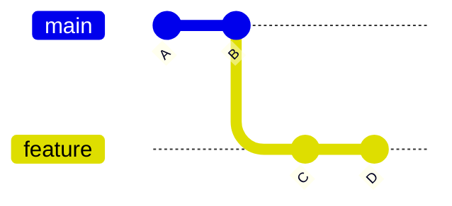
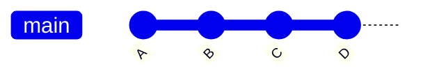
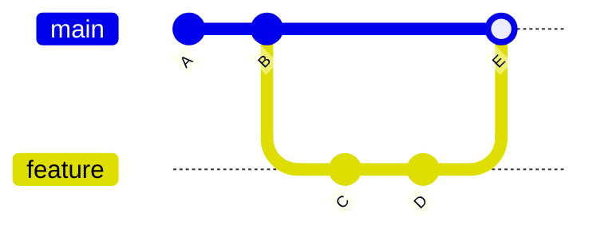
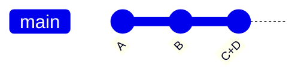

## Step 5: Working with Branches

With our game now tracked, we know it is easy to return to a working version. With that confidence, le'ts work on a new feature.

> Does it feel nice to not need to copy the entire project folder as a backup "just in case".

### 📖 Theory: Understanding Branches

Branches in Git are lightweight pointers (or labels) to commits. This allows working on a dependent version without influencing the original, something great for parallel feature development and collaboration.

Key Concepts:

- **`main` Branch**: Usually the trusted working version. (historically called `master`)
- **Feature Branch**: A safe isolated space to develop without affecting the trusted version.
- **Merging**: Combining changes from different branches.

### How do you combine branches?

There are multiple strategies for organizing commits. Usually, all in the name of different styles of organization, transparency, and traceability. Let's introduce the most common.

**Fast-forward merge**: Move the new commits from the child branch onto the parent branch.

<div align="center">

**Before:** Original



**After:** Fast Forward Merge



</div>

**Merge commit**: Apply the changes as a single new commit on the parent branch. Leave the child branch in the network for traceability.

<div align="center">

**Before:** Original


**After:** Merge Commit



</div>

**Squash merge**: Collapse the commits from one branch into a single new commit on the other branch.

<div align="center">

**Before:** Original


**After:** Squash Commit



</div>

### What are the important Git commands?

- `git branch "my-new-feature"` - Start a branch from the current branch.
- `git checkout "my-new-feature"` - Change your working directory to a different version from the repository history.
- `git merge` - Apply the commits from one branch onto another branch. (Default: Fast forward merge)

<!-- > [!TIP]
> You can perform a simple "undo" of the last commit with `git reset --soft HEAD~1`. For VS Code, use the Command Palette and search for `Undo Last Commit`. -->

> [!TIP]
> Git 2.23 introduced a the `git switch` command to simplify branch management. You might start seeing it referenced more often in the future.

<!-- Since Git 2.23 -->
<!-- `git switch --create <branch name>` -->
<!-- `git switch branch-name` -->

### ⌨️ Activity 1: Develop on a branch (using the CLI)

1. Before we start, let's visually check the current history.

   ```bash
   git log --graph --oneline
   ```

1. Create a new branch:

   - `git branch add-block-preview`

1. Show a list of the available branches.

   ```bash
   git branch --list
   ```

1. Open `main.js` and insert the following code.

   ```js
   // (pending)
   ```

1. Open `main.html` and insert the following code.

   ```html
   <!-- pending -->
   ```

1. Commit the change with the following message.

   ```txt
   git add src/main.js
   git add src/main.html
   git commit "add preview for upcoming block"
   ```

1. Update the readme.

   ```md
   (pending)
   ```

1. Commit the change with the following message.

   ```txt
   git add README.md
   git commit -m "add description of upcoming block feature"
   ```

1. Switch back to `main` branch:

   - `git checkout main`
   - or `git switch main`

1. Merge the new feature.

   ```bash
   git merge --no-ff add-block-preview
   ```

   For learning, we use the "not fast forward" option so the branch stays visible in the history. It will make our next history more interesting to explore.

1. Delete the pointer/label to the feature branch, since it is now merged.

   ```bash
   git branch --delete add-block-preview
   ```

   > 🪧 **Note**: This does not delete the branch content, just the name used for referencing it.

1. View the branching history. Notice the parallel branch we developed our new feature on.

   ```bash
   git log --graph --oneline
   ```

### ⌨️ Activity 2: Develop on a branch in VS Code

1. In the left navigation, open the Source Control panel.

1. To the right of the project name, click on the branch name `main`. A menu will appear with options.

1. Select **Create a new branch...** and enter the below name.

   ```txt
   cleanup-and-typos
   ```

1. Open `README.md` and fix the following typo.

   ```diff
   - Some txt
   + Some text
   ```

1. Add the file to the staging area and commit it with the below message.

   ```txt
   fix typo in readme
   ```

1. In the Source Control panel, notice the **Graph** section shows both branches in parallel.

1. Click on the branch name again and select `main`

1. Click the three dot menu (`...`), then `Branch`, and select `Merge...`

1. In the Source Control panel, notice the **Graph** section shows the merged branch.

<details>
<summary>Having trouble? 🤷</summary><br/>

- If you made a typo in your branch name, you can rename it with `git branch --move old-name new-name`

</details>
```
